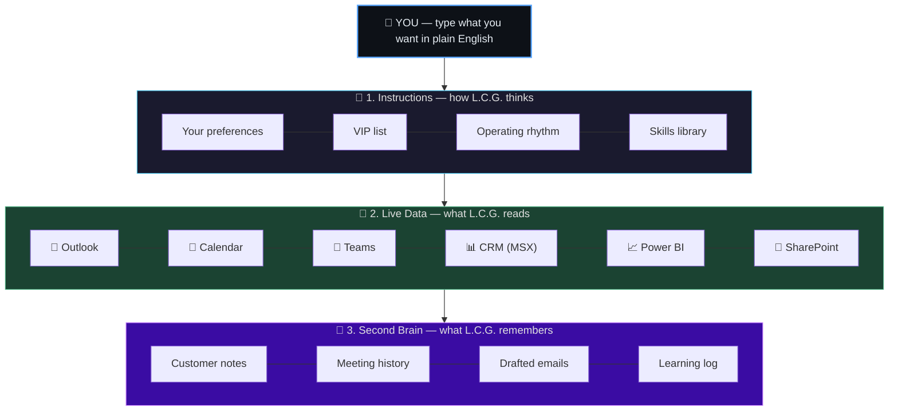
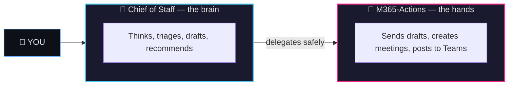

<p align="center">
  
</p>

# L.C.G.

### Let Copilot Go!

*Stop doing the low value cognitive work yourself. Let Copilot do it.*

<br/>

[](https://nodejs.org/)
[](https://github.com/features/copilot)
[](#)


---

## Quick Start (5 Minutes)
Before you begin, make sure you have:

- [ ] **Microsoft corporate VPN** connected
- [ ] **Microsoft corp account** (e.g., `your-alias@microsoft.com`) for Azure CLI sign-in
- [ ] **Personal GitHub account** (NOT your `_microsoft` EMU account) for GitHub Packages auth
- [ ] **GitHub Copilot License** — [Get one here (Microsoft Internal)](https://aka.ms/copilot)

---

### Step 0: Run The Installer

One command. About 5 minutes. The installer downloads the repo, installs anything missing (Node.js, Azure CLI, GitHub CLI, optionally VS Code and Obsidian), and walks you through sign‑in. Below is exactly what you'll see, in order.

> 💡 **Tip:** all prompts have a sensible default. If you're not sure, just press **Enter**.

#### macOS / Linux

Open **Terminal**, paste, press **Enter**:

```bash
curl -fsSL https://raw.githubusercontent.com/JinLee794/L.C.G/main/scripts/install.sh | bash
```

#### Windows — step by step

**1. Open Windows PowerShell.** Click Start, type "PowerShell", and pick **Windows PowerShell**. Not the blue ISE one — the regular one.


**2. Paste the one‑liner and press Enter.**

```powershell
Set-ExecutionPolicy -Scope Process Bypass -Force; $s = irm "https://raw.githubusercontent.com/JinLee794/L.C.G/lv-installation/scripts/install.ps1?nocache=$(Get-Date -UFormat %s)"; & ([scriptblock]::Create($s)) -Ref lv-installation
```

You'll see the L.C.G. banner with a time estimate for each component. That's the installer saying "hi, here's the plan."


**3. Pick where L.C.G. lives.** It suggests `C:\Users\<you>\L.C.G`. Press **Enter** to accept.

> 🔒 OneDrive / Dropbox / Google Drive / iCloud paths are blocked on purpose — secrets stay off the cloud.


**4. Read the security notice and type `yes`.** This confirms you're OK with installing local MCP servers. Anything else cancels the install.


**5. Let it install the small stuff** (git, Node.js, Azure CLI, GitHub CLI). The progress bar tells you it's working — sometimes winget takes a minute, that's normal.


**6. Sign in to Azure with your *work* account.** A browser window opens. Pick `your-alias@microsoft.com`. This is the **Azure CLI sign‑in to the Microsoft tenant** — it's how L.C.G. talks to CRM, Power BI, and other Microsoft systems.


**7. Sign in to GitHub with your *personal* account.** The installer prints a one‑time code (e.g. `F7A5‑ADE0`) and opens `github.com/login/device`. Paste the code, then sign in.

> [!IMPORTANT]
> Use your **personal GitHub account** (for example `lvolkov@outlook.com`). **Do NOT** use your `_microsoft` Enterprise Managed User account — it doesn't have access to the private packages L.C.G. needs.
>
> If the browser auto‑fills the `_microsoft` account, click **Use a different account**.


**8. Optional: install Obsidian Desktop?** Type `Y` or `N` — **either is fine**.

- **Type `Y`** if you want a pretty UI. Obsidian is *like OneNote, but for an LLM* — it shows your customer notes, meetings, and drafts as a connected knowledge graph.
- **Type `N`** if you'd rather just browse the files in Windows Explorer. Everything is plain Markdown. Nothing breaks either way.


**9. Optional: install VS Code?** Type `Y` or `N` — **also up to you**.

- **Type `Y`** if you like a graphical editor and want to use Copilot Chat with the **Chief of Staff** agent inside VS Code.
- **Type `N`** if you prefer to live in the terminal. You'll still get the global `lcg` command (powered by the GitHub Copilot CLI) and can do everything from there.


**10. Pick where the vault lives.** Press **Enter** to put it inside the L.C.G. folder (recommended). Or type a path to an existing Obsidian vault — starter templates are added without touching your notes.


**11. Wait for the green check.** The installer scaffolds the vault, links the global `lcg` command, and prints a summary table.


That's it. You're done.

---

### Step 1: Start Using L.C.G.

Two ways to use it. Pick whichever feels comfortable — same agents, same skills, same brain.

**🖥️ In VS Code (if you installed it):**

Open the L.C.G. folder → open **Copilot Chat** (`Ctrl+Alt+I` on Windows, `⌃⌘I` on macOS) → pick the **Chief of Staff** agent → start typing.


**⌨️ In a terminal:**

Open any terminal, type `lcg`, press **Enter**. A new Copilot CLI session launches with all of L.C.G. loaded.


> Both interfaces are equivalent. See [Two Ways to Use L.C.G.](#two-ways-to-use-lcg) for details.

---

### Step 2: Personalize It (Optional, 5 Minutes)

Defaults are fine for day one. When you want L.C.G. to match *your* role, VIPs, and cadence, run the onboarding wizard.

In VS Code → **Copilot Chat** → **Chief of Staff** agent → type:

```
/onboarding
```

The wizard asks about your:

1. **Role** — GM, CSAM, Specialist, or M1 Manager
2. **Industry** — Segment you cover (scopes CRM + Power BI queries)
3. **Team** — By territory, seller list, org hierarchy, or just you
4. **Forecast targets** — Optional quota and coverage multiple
5. **VIP list** — High-priority senders
6. **Operating rhythm** — Default weekly cadences

Answers are saved in your vault under `_lcg/` as plain markdown. Re-run `/onboarding` anytime, or edit the files directly.

---

<details>
<summary><strong>What the installer actually did (click to expand)</strong></summary>

The installer and bootstrap are designed to finish with minimal questions. For the curious, here's everything that happened:

1. **Downloaded** the repo to your install directory (default: `~/L.C.G`).
2. **Verified prerequisites** — Node.js 18+, npm, git.
3. **Installed missing tools automatically** (Windows via `winget` / Chocolatey; macOS via Homebrew):
   - **Azure CLI** (`az`) — for corp auth against CRM and M365.
   - **GitHub Copilot CLI** — the official `@github/copilot` npm package, which provides the `copilot` binary used by `lcg`. A `gh copilot` extension is configured as a fallback.
   - **Obsidian Desktop** — installed only if you answered **Yes** at the prompt.
4. **Prompted for `az login`** — sign in as `alias@microsoft.com`.
5. **Ran `npm install`** for repo dependencies.
6. **Walked through GitHub Packages auth** — uses your personal GitHub account (not your `_microsoft` EMU account).
7. **Created (or pointed at) your vault** based on your choice at the vault-location prompt, and seeded it with starter templates under `_lcg/` (never overwriting existing files).
8. **Registered the global `lcg` command** using a `.cmd` shim on Windows so it works in restricted-policy PowerShell.

> [!IMPORTANT]
> When prompted for GitHub auth, use your **personal GitHub account** (e.g., `JohnDoe`), not your Enterprise Managed User account ending in `_microsoft`.

> [!TIP]
> Run `./scripts/bootstrap.sh --check` (macOS/Linux) or `./scripts/bootstrap.ps1 -Check` (Windows) for a dry prerequisite check at any time.

</details>

<details id="switch-to-a-different-obsidian-vault">
<summary><strong>Switch to a different Obsidian vault (click to expand)</strong></summary>

You already picked a vault location during install. If you want to change your mind — point L.C.G. at a different existing vault, or create a new one elsewhere:

**a. Create or choose a vault.** If you don't have one yet, download [Obsidian](https://obsidian.md) → **Create new vault** → pick a name and location you'll remember. Otherwise note the full path to your existing vault (e.g. `/Users/you/Documents/Obsidian/My Vault`).

**b. Point `.env` at it.** Open `.env` in your install folder and update:

```dotenv
OBSIDIAN_VAULT_PATH="/Path/To/Your/Obsidian/Vault"
```

**c. Seed the L.C.G. structure** (safe — never overwrites existing files):

```bash
npm run vault:init
```

This adds the following under your vault, without touching any of your existing notes:

| Added | Purpose |
|---------|---------|
| `_lcg/preferences.md` | Triage labels, display preferences |
| `_lcg/vip-list.md` | VIP senders that get priority in triage |
| `_lcg/operating-rhythm.md` | Weekly cadences (triage time, review days) |
| `_lcg/communication-style.md` | Tone guidance for drafted emails |
| `_lcg/learning-log.md` | Corrections L.C.G. remembers across sessions |
| `_lcg/templates/` | Meeting briefs, update requests, weekly summaries |
| `Daily/`, `Meetings/`, `Weekly/` | Working output folders |

> `.env` is git-ignored. Your paths and secrets stay local.

</details>

---

## Why L.C.G. Exists

You already know the pain:

- **Hundreds of emails** — and you're manually deciding what matters before your first coffee
- **Back-to-back meetings** — prep means hunting across 5+ tools you didn't build and don't love
- **Same deliverables, every week** — rebuilt from scratch instead of compounding
- **Institutional memory** — trapped in your head, not in a system
- **Follow-ups everywhere** — scattered across email, CRM, Teams, and sticky notes

No single tool today reads across your M365 + CRM stack, remembers *your* priorities, and still lets you own every final call. So you Go. Every. Single. Day.

L.C.G. turns GitHub Copilot into the tireless junior staffer you always wanted — one that **pre-reads, pre-researches, and pre-drafts everything** so you can focus on judgment, relationships, and the work that actually needs a human.

---

## What You Get — Day One

Just type a command in Copilot Chat. No menus, no screens, no training required.

### ☀️ Every Morning

| Say this…                | …and get this                                                  |
| ------------------------ | -------------------------------------------------------------- |
| `/morning-triage`      | Prioritized daily brief: what's urgent, what can wait, who's waiting on you |
| `/meeting-brief`       | One-page prep for your next meeting — context, attendees, open items, risks |
| `/meeting-followup`    | Action items and next steps written for you after a meeting ends |
| `/update-request`      | Polished follow-up emails to customers who owe you an answer   |

### 📆 Every Week

| Say this…                | …and get this                                       |
| ------------------------ | --------------------------------------------------- |
| `/weekly-rob`          | Your rhythm-of-business summary, ready to send      |
| `/winning-wednesdays`  | Win-Room highlights condensed to what matters       |
| `/win-wire-digest`     | Big-deal recaps compiled for your team              |
| `/stu-highlights`      | Channel highlights you'd otherwise miss             |

### 🎯 On Demand

| Say this…                | …and get this                                                         |
| ------------------------ | --------------------------------------------------------------------- |
| "Review this opportunity" | Full deal deep-dive with recent signals, risks, and recommended next steps |
| "Run pipeline hygiene"   | Stale deals, missing fields, close-date drift — ranked by severity   |
| "Prep me for my 1:1"     | Seller's pipeline, recent movement, coaching opportunities            |
| "Build a deck on…"        | PowerPoint draft pulled from your vault + CRM data                    |

> **34+ skills** are bundled in. You never need to memorize names — just describe the outcome you want.

---

## How It Works (in plain English)

L.C.G. runs on three simple layers. You only ever interact with the first one.



| Layer | What it means for you |
| --- | --- |
| **1. Instructions** | Your style, your VIPs, your priorities — written in plain markdown. Edit anytime. |
| **2. Live Data** | One request, many systems read at once. No more tab-hopping. |
| **3. Second Brain** | L.C.G. remembers your customers, deals, and corrections. **It gets smarter every week.** |

### Two Agents — One Brain, One Set of Hands



The **brain** does all the thinking and never touches your inbox or Teams directly. The **hands** only act on scoped, approved instructions. If the brain wants to send a message, it hands off a draft — you approve before it leaves.

---

## You Stay in Control

Copilot Go's, but **nothing ships without you**.

| What L.C.G. does | What it won't do |
| --- | --- |
| ✅ **Drafts emails** in your voice | ❌ Never sends email without your review |
| ✅ **Prepares Teams messages** | ❌ Never posts without explicit approval |
| ✅ **Stages CRM updates** for review | ❌ Never writes to CRM silently |
| ✅ **Reads your vault** for context | ❌ Never syncs vault data to the cloud |
| ✅ **Logs every action** it takes | ❌ No surprise automation — ever |

> **Your data stays local.** Your vault lives on your machine. Your CRM credentials never leave your session. No external training. No "cloud memory." Just you and Copilot.

---

## What's Under the Hood

L.C.G. is built on four design principles that make it different from a chatbot:

| | Principle | Why it matters to you |
|---|---|---|
| 💬 | **Plain English config** | Change any behavior by editing a markdown file — no code, no IT ticket |
| 🏠 | **Local-first** | Your data never leaves your laptop |
| 🔀 | **Multi-signal** | One request cross-references email + calendar + CRM + your notes |
| 🔄 | **Self-correcting** | When you correct L.C.G., it remembers — and doesn't make the same mistake twice |

<details>
<summary><strong>Connected systems (for the curious)</strong></summary>

L.C.G. connects to your live enterprise data through a secure local bridge. One request reads from all of these at once:

| Category | Systems |
|---|---|
| 📧 **Communication** | Outlook Mail, Teams Chat, Teams Channels |
| 📅 **Scheduling** | Outlook Calendar, room booking |
| 📊 **CRM** | Microsoft Sales Experience (MSX) — opportunities, milestones, accounts |
| 📈 **Analytics** | Power BI — billed pipeline, consumption, SQL600, and more |
| 📁 **Files** | SharePoint, OneDrive, Word |
| 🗄️ **Memory** | Your local Obsidian vault |
| 🔍 **Search** | WorkIQ cross-M365 retrieval |

</details>

<details>
<summary><strong>Developer reference</strong></summary>

### Project structure
```
L.C.G/
├── .github/
│   ├── instructions/        ← behavior rules (triage, prep, CRM, comms)
│   ├── prompts/             ← workflow templates
│   ├── skills/              ← 34+ domain skills
│   └── agents/              ← agent definitions
├── scripts/                 ← automation helpers
├── vault-starter/           ← Obsidian vault templates
└── package.json
```

### MCP config
All live-data connections are declared in `.vscode/mcp.json`.

### npm scripts (optional, for headless runs)

| Command | Purpose |
| --- | --- |
| `npm run setup` | Verify prerequisites and configure local env |
| `npm run check` | Verify environment and workspace config |
| `npm run vault:init` | Bootstrap Obsidian vault from templates |
| `npm run morning:validate` | Validate morning brief output |
| `npm run meeting:validate` | Validate meeting brief |
| `npm run eval` | Run evaluation suite |

</details>

---

## Troubleshooting

### `npm ERR! 404 Not Found` or `401 Unauthorized` from `npm.pkg.github.com`

**What's happening:** Some MCP server packages (`@microsoft/msx-mcp-server`, `@jinlee794/obsidian-intelligence-layer`) are published to GitHub Packages, not the public npm registry. The project `.npmrc` already routes these scopes to the right place — but GitHub Packages requires a personal access token (PAT) for authentication, even for read-only access.

**Fix it in one step:**

```bash
npm login --registry=https://npm.pkg.github.com
```

When prompted:

- **Username:** your GitHub username
- **Password:** a personal access token (classic) with the `read:packages` scope
- **Email:** your GitHub email

That's it. The token is saved to your user-level `~/.npmrc` and applies everywhere.

<details>
<summary>Manual alternative (if <code>npm login</code> doesn't work)</summary>

1. Go to [github.com/settings/tokens](https://github.com/settings/tokens)
2. Click **Generate new token (classic)**
3. Select the **`read:packages`** scope
4. Copy the token
5. Open (or create) `~/.npmrc` and add this line:

```
//npm.pkg.github.com/:_authToken=ghp_YOUR_TOKEN_HERE
```

Replace `ghp_YOUR_TOKEN_HERE` with your actual token.

</details>

> **Why is this needed?** GitHub Packages doesn't support anonymous reads. The project-level `.npmrc` in this repo handles *which* packages go to GitHub vs. public npm — you just need to provide a token so GitHub lets you in.

### MCP server fails to start with `ERR_UNSUPPORTED_ESM_URL_SCHEME`

This usually means you're running a Node version older than 18. Check with `node --version` and upgrade if needed.

### `copilot CLI not found` when running automations

The task runner uses GitHub Copilot's CLI binary. It looks for it in:

1. `COPILOT_CLI_PATH` environment variable
2. `copilot` on your system PATH
3. VS Code's bundled location (`AppData/Code/User/globalStorage/github.copilot-chat/copilotCli/`)

Make sure GitHub Copilot Chat is installed in VS Code — it bundles the CLI automatically.

### Azure CLI token expired

CRM and M365 operations require an active Azure CLI session. If you see token errors:

```bash
az login
```

---

<div align="center">

*L.C.G. — Let Copilot Go — Private repository — Internal use only*

</div>
